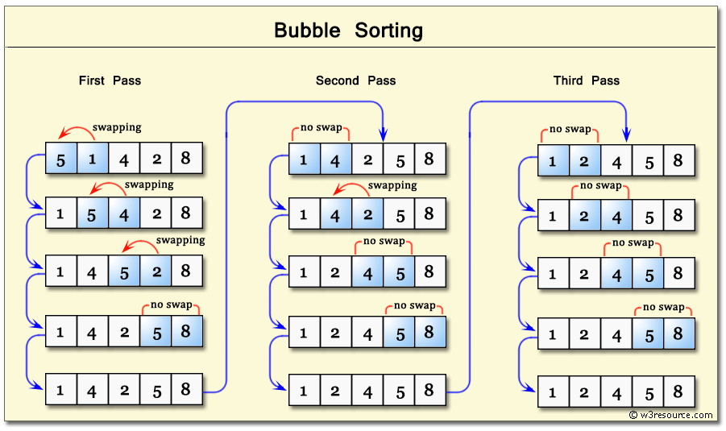

# Bubble Sort Lesson

Bubble Sort is a simple sorting algorithm that repeatedly steps through the list, compares adjacent elements, and swaps them if they are in the wrong order. The pass through the list is repeated until the list is sorted. The algorithm gets its name from the way smaller elements "bubble" to the top of the list.

While Bubble Sort is simple to understand and implement, it is not very efficient for large lists and is not often used in practice. However, it is an excellent algorithm for beginners to learn the fundamentals of sorting.

## How it Works

1.  **Start at the beginning:** Begin with the first element of the list.
2.  **Compare and Swap:** Compare the first element with the second. If the first is greater than the second, swap them.
3.  **Move to the next pair:** Move to the next pair of elements (the second and third), compare them, and swap if necessary.
4.  **Continue to the end:** Continue this process until you reach the end of the list. After the first pass, the largest element will have "sunk" to the end of the list.
5.  **Repeat:** Repeat the entire process for the remaining unsorted part of the list (i.e., from the beginning to the second-to-last element).
6.  **Stop when sorted:** If a full pass through the list results in no swaps, the list is sorted, and the algorithm can stop.

## Diagram

Here is a visual representation of the first pass of Bubble Sort on the list `[5, 1, 4, 2, 8]`.



## Pseudocode

```
procedure bubbleSort(list)
  n = length(list)
  for i from 0 to n-1
    swapped = false
    for j from 0 to n-i-2
      if list[j] > list[j+1]
        swap(list[j], list[j+1])
        swapped = true
      end if
    end for
    // If no two elements were swapped by inner loop, then break
    if not swapped
      break
    end if
  end for
end procedure
```

## Python Implementation

Here is how you can implement the Bubble Sort algorithm in Python:

```python
def bubble_sort(arr):
    n = len(arr)
    # Traverse through all array elements
    for i in range(n):
        swapped = False
        # Last i elements are already in place
        for j in range(0, n-i-1):
            # Traverse the array from 0 to n-i-1
            # Swap if the element found is greater
            # than the next element
            if arr[j] > arr[j+1]:
                arr[j], arr[j+1] = arr[j+1], arr[j]
                swapped = True
        if not swapped:
            break
    return arr

# Example usage:
my_list = [5, 1, 4, 2, 8]
sorted_list = bubble_sort(my_list)
print("Sorted list is:", sorted_list)
# Output: Sorted list is: [1, 2, 4, 5, 8]
```

## Exercise

1.  Take the list `[64, 34, 25, 12, 22, 11, 90]` and manually trace the Bubble Sort algorithm, writing down the state of the list after each pass.
2.  Modify the Python `bubble_sort` function to sort the list in **descending** order instead of ascending.
3.  What is the time complexity of Bubble Sort in the best, average, and worst cases? (Hint: Think about how many comparisons and swaps are made).
