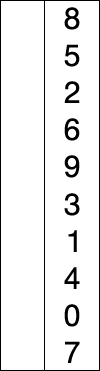

# Selection Sort Lesson

Selection Sort is an in-place comparison sorting algorithm. It has an O(n^2) time complexity, which makes it inefficient on large lists, and generally performs worse than the similar insertion sort. Selection sort is noted for its simplicity and has performance advantages over more complicated algorithms in certain situations, particularly where auxiliary memory is limited.

## How it Works

The algorithm divides the input list into two parts: a sorted sublist of items which is built up from left to right at the front (left) of the list and a sublist of the remaining unsorted items that occupy the rest of the list.

1.  **Find the minimum:** In the first pass, find the smallest element in the entire unsorted list.
2.  **Swap:** Swap the smallest element with the first element of the unsorted list.
3.  **Expand the sorted sublist:** The sorted portion of the list now includes the first element.
4.  **Repeat:** In the second pass, find the smallest element in the remaining unsorted list and swap it with the second element.
5.  **Continue:** Repeat this process, finding the next-smallest element and swapping it into the correct position, until the entire list is sorted.

## Diagram

Here is a visual representation of Selection Sort.



## Pseudocode

```
procedure selectionSort(list)
  n = length(list)
  for i from 0 to n-2
    // Find the minimum element in the unsorted part of the list
    minIndex = i
    for j from i+1 to n-1
      if list[j] < list[minIndex]
        minIndex = j
      end if
    end for
    // Swap the found minimum element with the first element of the unsorted part
    swap(list[minIndex], list[i])
  end for
end procedure
```

## Python Implementation

```python
def selection_sort(arr):
    # Traverse through all array elements
    for i in range(len(arr)):
        # Find the minimum element in remaining unsorted array
        min_idx = i
        for j in range(i + 1, len(arr)):
            if arr[min_idx] > arr[j]:
                min_idx = j
        # Swap the found minimum element with the first element
        arr[i], arr[min_idx] = arr[min_idx], arr[i]
    return arr

# Example usage:
my_list = [64, 25, 12, 22, 11]
sorted_list = selection_sort(my_list)
print("Sorted list is:", sorted_list)
# Output: Sorted list is: [11, 12, 22, 25, 64]
```

## Exercise

1.  Trace the execution of Selection Sort on the list `[29, 10, 14, 37, 13]`. Write down the state of the list after each swap.
2.  Selection Sort and Bubble Sort both have a time complexity of O(n^2). In what scenarios might one be preferable over the other? (Hint: consider the number of swaps).
3.  Implement Selection Sort to sort a list of tuples based on their second element. For example: `[( 'a' , 3), ( 'b' , 1), ( 'c' , 2)]` should become `[( 'b' , 1), ( 'c' , 2), ( 'a' , 3)]`.
