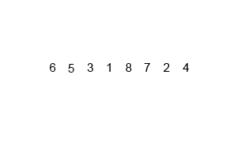

# Merge Sort Lesson

Merge Sort is an efficient, comparison-based, and stable sorting algorithm. Most implementations produce a stable sort, which means that the implementation preserves the input order of equal elements in the sorted output. It is a divide and conquer algorithm.

## How it Works

Merge Sort works by recursively breaking down a list into several sub-lists until each sub-list contains a single element, and then merging those sub-lists in a manner that results into a sorted list.

1.  **Divide:** The unsorted list is divided into `n` sublists, each containing one element (a list of one element is considered sorted).
2.  **Conquer (Merge):** Repeatedly merge sublists to produce new sorted sublists until there is only one sublist remaining. This will be the sorted list.

The merging process is the core of the algorithm:
- Create an empty list.
- Compare the first elements of the two sublists you are merging.
- Add the smaller of the two to the empty list.
- Repeat until one of the sublists is empty.
- Add the remaining elements from the non-empty sublist to the end of the new list.

## Diagram

Here is a visual representation of Merge Sort.



## Pseudocode

```
procedure mergeSort(list)
  if length(list) > 1
    mid = length(list) / 2
    leftHalf = list[0...mid]
    rightHalf = list[mid...length(list)]

    mergeSort(leftHalf)
    mergeSort(rightHalf)

    i = 0
    j = 0
    k = 0

    while i < length(leftHalf) and j < length(rightHalf)
      if leftHalf[i] < rightHalf[j]
        list[k] = leftHalf[i]
        i = i + 1
      else
        list[k] = rightHalf[j]
        j = j + 1
      end if
      k = k + 1
    end while

    while i < length(leftHalf)
      list[k] = leftHalf[i]
      i = i + 1
      k = k + 1
    end while

    while j < length(rightHalf)
      list[k] = rightHalf[j]
      j = j + 1
      k = k + 1
    end while
  end if
end procedure
```

## Python Implementation

```python
def merge_sort(arr):
    if len(arr) > 1:
        mid = len(arr) // 2  # Finding the mid of the array
        L = arr[:mid]  # Dividing the array elements
        R = arr[mid:]  # into 2 halves

        merge_sort(L)  # Sorting the first half
        merge_sort(R)  # Sorting the second half

        i = j = k = 0

        # Copy data to temp arrays L[] and R[]
        while i < len(L) and j < len(R):
            if L[i] < R[j]:
                arr[k] = L[i]
                i += 1
            else:
                arr[k] = R[j]
                j += 1
            k += 1

        # Checking if any element was left
        while i < len(L):
            arr[k] = L[i]
            i += 1
            k += 1

        while j < len(R):
            arr[k] = R[j]
            j += 1
            k += 1
    return arr

# Example usage:
my_list = [12, 11, 13, 5, 6, 7]
sorted_list = merge_sort(my_list)
print("Sorted list is:", sorted_list)
# Output: Sorted list is: [5, 6, 7, 11, 12, 13]
```

## Exercise

1.  Manually trace the Merge Sort algorithm on the list `[38, 27, 43, 3, 9, 82, 10]`. Draw the tree of recursive calls and the merging steps.
2.  Merge Sort has a time complexity of O(n log n). Why is it generally faster than O(n^2) algorithms like Bubble Sort for large lists?
3.  Merge Sort requires additional memory to create the sublists. How much extra space does it need? This is known as its space complexity.
