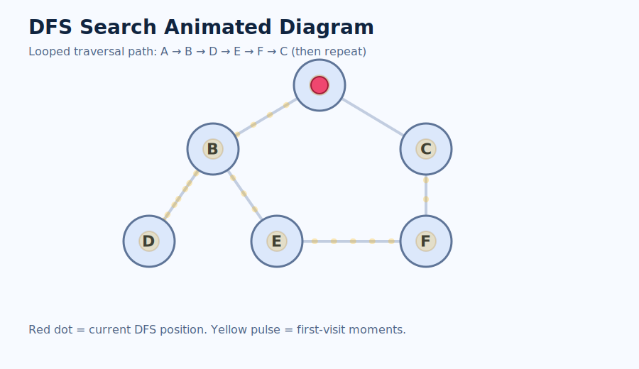

# DFS Search Diagram

This diagram shows how DFS searches for a target node by going deep first, then backtracking.



## Graph (Adjacency List)

- A: B, C
- B: D, E
- C: F
- D: -
- E: F
- F: -

## Graph Shape

```text
        A
       / \
      B   C
     / \   \
    D   E   F
         \
          F
```

## Search Example 1: Find `E` starting from `A`

DFS visit order:

```text
A -> B -> D -> (backtrack) -> E   (FOUND)
```

Step trace:

1. Visit `A` (not target)
2. Go to `B` (not target)
3. Go to `D` (not target, dead end)
4. Backtrack to `B`
5. Go to `E` (target found)

## Search Example 2: Find `Z` starting from `A`

DFS visit order:

```text
A -> B -> D -> (backtrack) -> E -> F -> (backtrack) -> C -> F(already visited) -> end
```

Result: `Z` is not found, so the function returns `False`.

## Backtracking Diagram

```text
Forward:    A -> B -> D
Backtrack:  D -> B
Forward:    B -> E -> F
Backtrack:  F -> E -> B -> A
Forward:    A -> C
```

## Key Idea

- DFS search checks `if node == target` when each node is visited.
- `visited` prevents infinite loops and repeated work.
